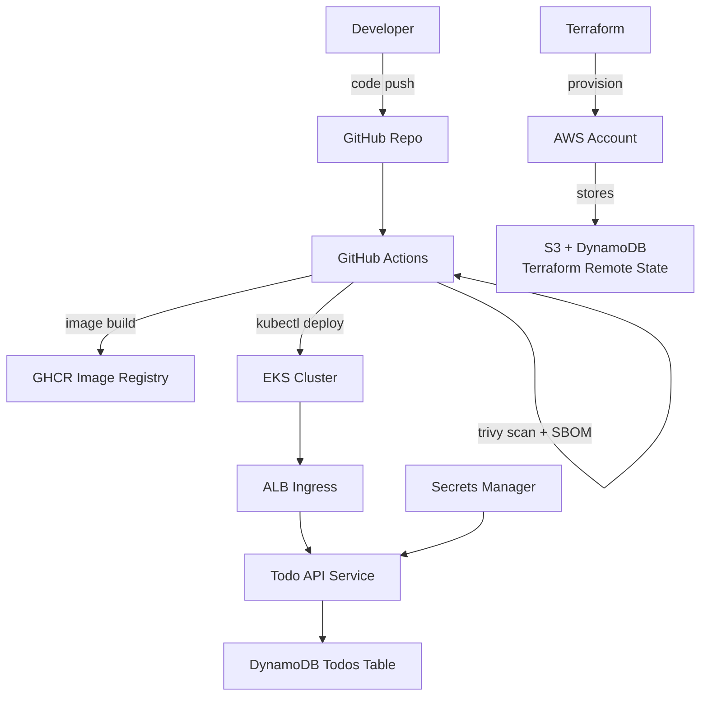

# Todo API — DevOps & Cloud Security Assessment

This repository delivers a production-ready Node.js REST API with infrastructure-as-code, CI/CD automation, and security controls suitable for a minimal AWS EKS deployment. It satisfies the requirements outlined in the assessment brief and documents the operational and security posture of the solution.

## Table of Contents
- [Architecture Overview](#architecture-overview)
- [Local Development](#local-development)
- [Testing](#testing)
- [Container Image](#container-image)
- [CI/CD Pipeline](#cicd-pipeline)
- [Infrastructure as Code](#infrastructure-as-code)
- [Kubernetes Manifests](#kubernetes-manifests)
- [Security Controls](#security-controls)
- [Scenario Responses](#scenario-responses)
- [Short-Form Answers](#short-form-answers)
- [Trade-offs & Future Improvements](#trade-offs--future-improvements)

## Architecture Overview


## Local Development

1. **Install dependencies**
   ```bash
   npm install
   ```
2. **Run the service**
   ```bash
   npm start
   ```
   The API listens on `http://localhost:3000` with:
   - `GET /healthz`
   - `GET /api/v1/todos`
   - `POST /api/v1/todos`

3. **Environment variables**
   - `PORT` *(default 3000)*
   - `GIT_SHA` *(commit injected by CI/CD to surface in `/healthz`)*
   - `LOG_LEVEL` *(Pino log level, default `info`)*

## Testing

- Unit + integration tests (Jest + Supertest):
  ```bash
  npm test
  ```
- ESLint:
  ```bash
  npm run lint
  ```

Test coverage is collected automatically via Jest and uploaded as an artifact in CI.

## Container Image

- Multi-stage build (`Dockerfile`) based on `node:20-alpine`.
- Runs as the non-root `node` user with a read-only root filesystem.
- Build argument `GIT_SHA` populates image labels and the `/healthz` response.
- `.dockerignore` keeps the build context minimal.

To build locally:
```bash
docker build --build-arg GIT_SHA=$(git rev-parse HEAD) -t todo-api:local .
```

## CI/CD Pipeline

GitHub Actions workflow: `.github/workflows/ci.yaml`

1. **Build & Test** — `npm ci`, ESLint, Jest, `npm audit --audit-level=high`.
2. **Image Build & Scan** — Docker Buildx, Trivy scan (fail on High/Critical), SBOM generation via `anchore/sbom-action`.
3. **Deploy** — On `main` with cluster metadata provided via GitHub environment/organization variables:
   - Assumes an AWS IAM role (`DEPLOY_ROLE_ARN`).
   - Renders manifests with `envsubst` to inject `GIT_SHA` and IRSA role ARN.
   - Applies manifests and verifies rollout.

The workflow exposes the git SHA to the application through environment variables, image labels, and Pod annotations, ensuring traceability from code to runtime.

## Infrastructure as Code

Terraform configuration under `infra/terraform/` provisions:

- **Networking** — VPC with three AZ coverage, public subnets for ALB, private subnets for worker nodes, single NAT gateway.
- **Compute** — EKS cluster (v1.29) using the official module with IRSA enabled, spot + on-demand managed node groups for availability and cost efficiency.
- **State Management** — `backend.tf` configures an S3 bucket with DynamoDB table for state locking (replace `CHANGEME` placeholders). State bucket must enforce SSE-KMS and block public access.
- **Data Layer** — DynamoDB table for todos with pay-per-request billing.
- **Secrets** — KMS-managed AWS Secrets Manager secret storing application configuration (e.g., DynamoDB table name).
- **IAM** — Dedicated IAM role for the Kubernetes service account with least-privilege access to the DynamoDB table.

> **Applying Terraform**
> ```bash
> cd infra/terraform
> terraform init
> terraform plan -var 'project=vmss-node' -var 'environment=dev'
> terraform apply
> ```
> Provide real values for the backend bucket/table and configure AWS credentials before running.

## Kubernetes Manifests

Stored in `k8s/` and rendered via `envsubst` during deployment:

- Namespace, ConfigMap, Secret placeholder, and ServiceAccount (IRSA annotated).
- Deployment with readiness/liveness probes, Prometheus annotations, resource requests/limits, and hardened security context.
- ClusterIP Service and ALB-backed Ingress with TLS from ACM.
- NetworkPolicies enforcing default deny with explicit ingress/egress rules.

### Runtime Configuration

- `todo-api-secrets` should be populated by AWS Secrets Manager (via AWS Secrets CSI or External Secrets) with `DATABASE_TABLE` and any other secrets.
- `todo-api-config` centralizes non-secret configuration (e.g., AWS region).

## Security Controls

| Layer | Control |
| --- | --- |
| **Application** | Input validation, structured JSON logging (Pino), Prometheus metrics, graceful error handling. |
| **Container** | Minimal base image, multi-stage build, non-root user, read-only root FS, OCI metadata labels. |
| **CI/CD** | Linting, unit tests, dependency audit, Trivy scan gating High/Critical issues, SBOM artifact, commit SHA propagation. |
| **Infrastructure** | Terraform-managed VPC, private nodes, IRSA for least-privilege DynamoDB access, Secrets Manager with customer-managed KMS key. |
| **Kubernetes** | Resource limits, probes, NetworkPolicies (default deny + ALB allow), TLS-terminated ALB, pod security context dropping capabilities. |
| **Observability** | Request logging, structured metrics, `/metrics` endpoint for Prometheus, logs routed to CloudWatch (via standard stdout). |

## Scenario Responses

**Incident Response — Suspicious Egress from EKS**
1. **Immediate containment**: isolate impacted pods by scaling to zero or applying restrictive NetworkPolicies; capture pod manifests and security groups before tearing down.
2. **Evidence capture**: collect pod logs, AWS VPC Flow Logs, and container filesystem snapshots (e.g., `kubectl cp`) for forensic analysis; preserve AWS CloudTrail events.
3. **Short-term monitoring**: enable GuardDuty (if not already), deploy egress IDS rules, and set CloudWatch alarms on anomalous egress metrics.
4. **24-hour actions**: rotate credentials (IRSA roles, secrets), patch container images, redeploy from trusted artifacts, and run post-incident review with identified root causes.

**Secrets Management — .env in Repo**
- **Risks**: Secret sprawl, accidental disclosure via forks/backups, lack of rotation visibility, and violation of least privilege.
- **Plan**: Migrate secrets into AWS Secrets Manager with IAM policies limiting access to CI/CD + runtime IRSA role, use Terraform or AWS CLI for bulk import, update the app to load secrets via SDK/CSI driver, and initiate a rotation schedule (e.g., Lambda/Secrets Manager rotation) with post-rotation validation.

**Zero-Trust in Kubernetes**
- Identity via IRSA-bound service accounts; enforce RBAC with namespace-scoped roles granting the API only ConfigMap/Secret read privileges it needs.
- Policy with admission controls (OPA/Gatekeeper/Kyverno) requiring signed images, non-root pods, and specific annotations.
- Segmentation using NetworkPolicies for default deny, service mesh (e.g., AWS App Mesh/Istio) to enable mTLS and per-service authorization policies.

**Supply Chain Hardening**
- Pin base images by digest and sign/publish images using Cosign with provenance metadata.
- Generate SBOMs (Syft/Anchore) and store alongside build artifacts; scan dependencies with Trivy/Snyk and monitor advisories.
- Adopt SLSA-aligned provenance by using GitHub OIDC + signed attestations and restricting deploys to attested artifacts only.

**Cost vs Security — Image Scanning Pressure**
- Keep scanning but optimize: parallelize builds/scans, cache DB updates, and establish severity budgets (e.g., allow medium/low but block high/critical).
- Implement allowlists for vetted false positives with documented expiry dates, and offer asynchronous scans post-deploy with auto-rollback triggers for new high findings.

## Short-Form Answers

- **Security Group vs NACL**: Security groups are stateful, instance-level virtual firewalls evaluated on allow rules; Network ACLs are stateless, subnet-level filters supporting allow/deny rules and requiring return traffic entries.
- **Terraform state purpose & protection**: State tracks real infrastructure to detect drift. Secure it by storing in S3 with versioning + SSE-KMS encryption and by enabling DynamoDB state locking with IAM policies restricting access; additionally, enforce MFA/least-privilege on state bucket access.
- **Container image scanning tools**: Trivy, Grype, Clair, and Aqua are common; this project uses Trivy and documents Grype as an alternative.
- **Kubernetes RBAC for ConfigMap access**: Create a Role in the namespace with `get/list/watch` on ConfigMaps and bind it to the service account via a RoleBinding.
- **IRSA advantages**: IRSA issues pod-scoped credentials via the EKS OIDC provider so each service account assumes a least-privilege IAM role, avoiding node-level instance roles that expose broad permissions to all pods on the node.

## Trade-offs & Future Improvements

- **DynamoDB vs In-memory**: The app uses in-memory storage for simplicity during local testing; Terraform includes a DynamoDB table and IAM policy to support production persistence.
- **Secrets sync**: Manifests expect Secrets Manager integration (e.g., AWS Secrets & Config Provider). Automating the sync via External Secrets Operator would remove manual steps.
- **Admission control**: Adding Gatekeeper/Kyverno policies to enforce image signing and resource limits cluster-wide is recommended.
- **Progressive delivery**: Integrate Argo Rollouts or blue/green ALB target groups for safer deployments.
- **Automated DAST**: Extend CI with OWASP ZAP baseline scans against a staging endpoint post-deploy.
